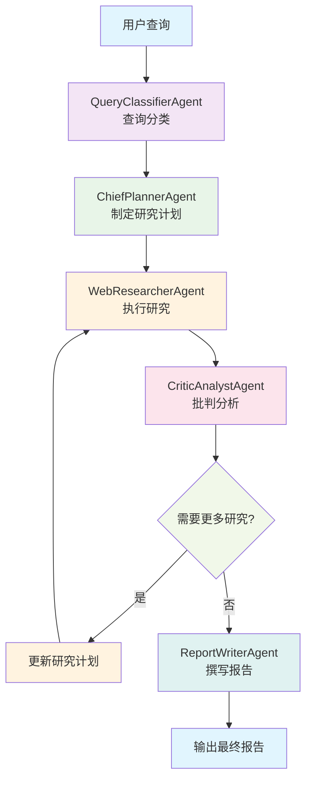

# 🤖 DeepDive Analyst

AI技术专家调研与分析智能体团队

## 📖 项目简介

DeepDive Analyst 是一个基于多智能体协作的自动化技术调研系统。它能够针对用户提出的复杂IT技术问题，进行深入的信息检索、分析、整合，并生成结构化、高质量的调研报告。

## ✨ 核心特性

- **多智能体协作**: 系统由多个职责明确的Agent协作完成任务
- **非线性工作流**: 利用LangGraph实现"研究-批判-修正"的迭代循环
- **智能模板选择**: 根据查询意图动态选择最合适的报告模板
- **可解释的工作过程**: 支持LangSmith等工具进行可视化调试
- **多LLM支持**: 支持OpenAI、Google Gemini、阿里通义千问、Anthropic Claude
- **容器化部署**: 支持Docker容器化部署

## 🏗️ 核心设计理念

### 🤖 Agent角色定义

DeepDive Analyst 采用**多智能体协作**的设计理念，每个Agent都有明确的角色定位和职责分工：

#### 1. **QueryClassifierAgent** - 查询意图分类专家
- **角色**: 查询意图分类专家
- **职责**: 准确识别用户查询的意图类型，为后续处理提供正确的分类标签
- **能力**: 快速理解技术问题意图，分类为对比分析、深度解析、技术巡览等类型

#### 2. **ChiefPlannerAgent** - 首席调研规划师
- **角色**: 首席调研规划师
- **职责**: 制定详细的研究计划，将复杂问题分解为可执行的研究任务
- **能力**: 将抽象技术问题转化为具体、可执行的研究计划

#### 3. **WebResearcherAgent** - 网络信息研究员
- **角色**: 网络信息研究员
- **职责**: 通过网络搜索收集准确、全面的技术信息
- **能力**: 精通网络搜索技巧，快速找到最相关、最权威的技术资料

#### 4. **CriticAnalystAgent** - 批判性分析师
- **角色**: 批判性分析师
- **职责**: 审查研究结果的质量和完整性，提出改进建议
- **能力**: 识别研究中的不足和矛盾，提出建设性改进建议

#### 5. **ReportWriterAgent** - 技术报告撰写师
- **角色**: 技术报告撰写师
- **职责**: 将研究结果整合为结构清晰、内容详实的技术报告
- **能力**: 将复杂技术信息转化为清晰易懂的报告

### 🔄 工作流设计

系统采用**LangGraph**实现非线性工作流，核心是"研究-批判-修正"的迭代循环：



### 🎯 设计优势

1. **职责分离**: 每个Agent专注于特定任务，提高效率和准确性
2. **迭代优化**: 通过批判-修正循环确保研究质量
3. **状态管理**: LangGraph提供完整的状态跟踪和错误处理
4. **可扩展性**: 易于添加新的Agent或修改工作流程
5. **可观测性**: 支持LangSmith等工具进行调试和监控

## 🛠️ 技术栈

- **CrewAI** - 多智能体协作框架
- **LangGraph** - 工作流编排和状态管理
- **Tavily** - 网络搜索API
- **OpenAI/Gemini/Qwen/Claude** - 大语言模型
- **Typer** - 命令行界面
- **Rich** - 终端美化
- **Pytest** - 测试框架
- **LangSmith** - 可观测框架
- **Docker** - 容器化部署


## ⚙️ 安装与配置

### 🔧 1. 环境要求

- Python 3.13.5
- 虚拟环境 (推荐)
- Docker (可选，用于容器化部署)

### 📦 2. 安装依赖

#### 方式一：本地安装

```bash
# 创建虚拟环境
python -m venv venv

# 激活虚拟环境
# Windows
venv\\Scripts\\activate
# Linux/Mac
source venv/bin/activate

# 安装依赖
pip install -r requirements.txt
```

#### 方式二：Docker 部署

```bash
# 构建 Docker 镜像
docker build -t deepdive-analyst .

# 运行容器
docker run --rm \
  -e LLM_PROVIDER=openai \
  -e OPENAI_API_KEY=your_api_key \
  -e TAVILY_API_KEY=your_tavily_key \
  deepdive-analyst python main.py research --query "测试查询"
```

### 🔑 3. 配置API密钥

复制 `.env.example` 文件为 `.env` 并填入真实的API密钥：

```bash
cp env.example .env
```

编辑 `.env` 文件，填入以下API密钥：

```env
# LLM 提供商配置
LLM_PROVIDER=openai
LLM_MODEL=gpt-4o-mini
LLM_TEMPERATURE=0.1

# OpenAI API 配置
OPENAI_API_KEY=your_openai_api_key_here

# Google Gemini API 配置
GEMINI_API_KEY=your_gemini_api_key_here

# 阿里通义千问 API 配置
QWEN_API_KEY=your_qwen_api_key_here

# Anthropic Claude API 配置
ANTHROPIC_API_KEY=your_anthropic_api_key_here

# Tavily 搜索API配置
TAVILY_API_KEY=your_tavily_api_key_here

# LangSmith 配置 (可选)
LANGCHAIN_TRACING_V2=true
LANGCHAIN_API_KEY=your_langsmith_api_key_here
LANGCHAIN_PROJECT=deepdive-analyst
```

## 🚀 使用方法

### 🎯 基本用法

```bash
# 执行技术调研
python main.py research --query "对比CrewAI和Autogen在实现多智能体协作方面的异同点" --output "comparison_report.md"

# 查看帮助
python main.py --help

# 查看版本信息
python main.py version

# 查看配置信息
python main.py config

# 查看LLM提供商信息
python main.py llm

# 查看使用示例
python main.py examples

# 运行测试套件
python main.py test
```

### 🐳 Docker 使用

```bash
# 直接运行 Docker 容器
docker run --rm \
  -e LLM_PROVIDER=openai \
  -e OPENAI_API_KEY=your_key \
  -e TAVILY_API_KEY=your_tavily_key \
  -v $(pwd)/output:/app/output \
  deepdive-analyst python main.py research \
  --query "对比React和Vue的优缺点" \
  --output "/app/output/react_vs_vue.md"

# 查看 Docker 帮助
docker run --rm deepdive-analyst python main.py --help
```

### 🔥 高级用法

```bash
# 使用指定模板类型
python main.py research --query "对比React和Vue的优缺点" --template comparison

# 设置最大迭代次数
python main.py research --query "深入解释Docker容器技术" --max-iterations 5

# 启用详细日志
python main.py research --query "盘点目前主流的机器学习框架" --verbose

# 组合使用多个选项
python main.py research --query "如何使用Kubernetes部署应用" --template tutorial --max-iterations 3 --verbose --output "k8s_guide.md"
```

### 📝 支持的查询类型

系统支持以下四种查询类型：

1. **对比分析** (comparison): "对比A和B的优劣"
2. **深度解析** (deep_dive): "深入解释X的工作原理"
3. **技术巡览** (survey): "盘点Y领域的主要技术"
4. **实践指南** (tutorial): "如何使用Z完成某项任务"

### 🤖 LLM提供商支持

项目支持多种LLM提供商，可以通过环境变量轻松切换：

#### 🟢 OpenAI (默认)
```env
LLM_PROVIDER=openai
LLM_MODEL=gpt-4o-mini
OPENAI_API_KEY=your_key
```

#### 🟡 Google Gemini
```env
LLM_PROVIDER=gemini
LLM_MODEL=gemini/gemini-1.5-pro
GEMINI_API_KEY=your_key
```

#### 🔵 阿里通义千问
```env
LLM_PROVIDER=qwen
LLM_MODEL=qwen-max
QWEN_API_KEY=your_key
```

#### 🟣 Anthropic Claude
```env
LLM_PROVIDER=anthropic
LLM_MODEL=claude-3-5-sonnet-20241022
ANTHROPIC_API_KEY=your_key
```

#### ⚡ 快速配置
```bash
# 使用配置脚本快速设置
python scripts/setup_llm.py

# 查看支持的提供商
python main.py llm

# 测试当前配置
python examples/multi_llm_example.py
```


## 🧪 测试覆盖

项目包含完整的测试套件，全部通过：

- **多LLM集成测试** - 验证不同LLM提供商的集成和功能
- **搜索工具测试**  - 验证搜索和网页抓取功能
- **线性工作流测试** - 验证基础工作流 
- **LangGraph工作流测试** - 验证核心循环逻辑
- **模板系统测试** - 验证报告模板功能

## 🎯 使用示例

```bash
# 对比分析
python main.py research --query "对比React和Vue的优缺点" --template comparison

# 深度解析
python main.py research --query "深入解释Docker容器技术" --template deep_dive

# 技术巡览
python main.py research --query "盘点目前主流的机器学习框架" --template survey

# 实践指南
python main.py research --query "如何使用Kubernetes部署应用" --template tutorial

# 高级选项
python main.py research --query "你的查询" --max-iterations 5 --verbose --output "custom_report.md"
```

### 🤝 Agent协作模式

DeepDive Analyst 的核心创新在于**智能体协作模式**的设计：

#### 🔄 迭代式质量保证
- **研究阶段**: WebResearcherAgent 收集信息
- **批判阶段**: CriticAnalystAgent 评估质量
- **修正阶段**: 根据批判结果决定是否需要继续研究
- **循环优化**: 最多3轮迭代，确保信息完整性

#### 📊 状态驱动的协作
- **GraphState**: 统一的状态管理，所有Agent共享状态信息
- **条件分支**: 基于批判结果智能决定下一步行动
- **错误处理**: 完整的异常处理和恢复机制

#### 🎯 专业化分工
- **单一职责**: 每个Agent专注于特定领域
- **能力互补**: 不同Agent的能力相互补充
- **质量把关**: CriticAnalystAgent 作为质量守门员

### 📁 项目结构
```
DeepDive_Analyst/
├── src/
│   ├── agents/          # 智能体实现
│   │   └── base_agents.py
│   ├── tools/           # 外部工具集成
│   │   └── search_tools.py
│   ├── workflows/       # LangGraph工作流
│   │   ├── linear_workflow.py
│   │   └── langgraph_workflow.py
│   ├── llm/             # LLM抽象层
│   │   ├── base_llm.py
│   │   ├── providers.py
│   │   └── llm_factory.py
│   └── configs/         # 配置文件
│       ├── config.py
│       └── templates.py
├── tests/               # 测试文件
├── docs/                # 项目文档
├── examples/            # 使用示例
├── scripts/             # 配置脚本
├── Dockerfile           # Docker 配置
├── .dockerignore        # Docker 忽略文件
├── main.py             # 主程序入口
├── requirements.txt    # 项目依赖
├── env.example         # 环境配置模板
└── README.md          # 项目说明
```

## 🚀 核心特性详解

### 🤝 1. 多智能体协作
- 5个专业化Agent各司其职
- 清晰的职责分工和协作机制
- 基于CrewAI的标准化实现

### 🔄 2. 非线性工作流
- LangGraph实现的"研究-批判-修正"循环
- 智能的条件路由和状态管理
- 可配置的最大迭代次数

### 🎨 3. 智能模板选择
- 4种专业报告模板
- 自动查询意图分类
- 动态模板应用和内容填充

### 👁️ 4. 可观测性
- 完整的日志记录系统
- 详细的工作流执行摘要
- 支持LangSmith集成

### 👥 5. 用户友好
- 专业的命令行界面
- 丰富的参数选项
- 详细的使用示例和帮助信息

### 🐳 6. 容器化部署
- 完整的Docker支持
- 环境变量配置
- 数据持久化
- 健康检查

## 🔮 未来扩展方向

1. **更多搜索源** - 集成更多搜索API和数据库
2. **高级分析** - 添加数据分析和可视化功能
3. **多语言支持** - 支持多语言查询和报告生成
4. **Web界面** - 开发Web UI界面
5. **API服务** - 提供REST API服务
6. **插件系统** - 支持自定义Agent和工具插件

## 🏆 项目亮点

1. **完整的端到端实现** - 从用户输入到报告输出的完整流程
2. **高度模块化设计** - 清晰的架构和职责分离
3. **全面的测试覆盖** - 50个测试用例确保代码质量
4. **专业的用户体验** - 丰富的CLI功能和详细文档
5. **可扩展的架构** - 易于添加新功能和集成
6. **多LLM支持** - 支持主流LLM提供商，灵活切换
7. **容器化部署** - 支持Docker部署，环境一致性


## 🤝 贡献指南

1. 遵循PEP 8编码规范
2. 为所有公共函数添加文档字符串
3. 使用pytest编写单元测试
4. 保持函数短小，专注于单一职责

## 🚀 CI/CD 流水线

项目包含完整的 Jenkins CI/CD 流水线配置：

### 🔄 自动化流程
- **代码质量检查**: flake8, black, isort, mypy
- **安全扫描**: bandit, safety
- **多环境测试**: 单元测试、集成测试、性能测试
- **Docker 构建**: 自动构建和推送镜像


## 📞 联系方式

如有问题或建议，请通过GitHub Issues联系我。